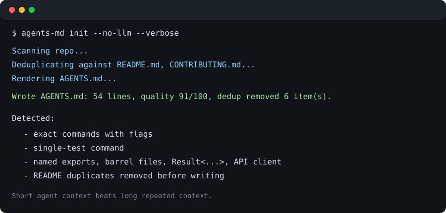

# agents-md

Generate `AGENTS.md` context files that actually help AI coding agents.

[](https://github.com/osmaneb23/agents-md/actions)
[](https://pypi.org/project/agent-context-md/)
[](pyproject.toml)
[](LICENSE)



*Demo runs on a JS/TS repo. Simpler repos generate shorter files.*

---

ETH Zurich [tested AI coding agents](https://arxiv.org/abs/2602.11988) across 8 benchmarks with auto-generated context files, hand-written files, and nothing. Auto-generated files made performance worse in 5 of 8 cases. Inference cost jumped 20-23%. Tasks took more steps.

The cause: generators write what agents can already read. Your README, your folder structure, your lint rules — the agent figures all of this out on its own. Putting it in AGENTS.md means reading it again on every task and paying for it each time.

`agents-md` reads your existing docs before writing anything. Everything the agent can discover on its own gets filtered out. What's left — exact commands with real flags, conventions the agent would get wrong, hard limits — is what ends up in the file.

This repo's own AGENTS.md was generated by `agents-md`.

---

## Contents

- [Install](#install)
- [Usage](#usage)
- [Sample output](#sample-output)
- [How deduplication works](#how-deduplication-works)
- [Quality scoring](#quality-scoring)
- [GitHub Action](#github-action)
- [What gets detected](#what-gets-detected)
- [Alternatives](#alternatives)
- [Development](#development)

---

## Install

```bash
pip install agent-context-md
```

The PyPI package is `agent-context-md`; the installed command is `agents-md`.

Zero runtime dependencies. No Node.js, no Docker.

LLM provider SDKs are optional extras — the tool works fully offline without them:

```bash
pip install agent-context-md[anthropic]
pip install agent-context-md[openai]
pip install agent-context-md[gemini]
```

Or run it with uv:

```bash
uvx --from agent-context-md agents-md init
```

---

## Usage

**Generate:**

```bash
# Static analysis only, no API key needed
agents-md init --no-llm

# With LLM synthesis (picks up key from env)
ANTHROPIC_API_KEY=sk-...  agents-md init
OPENAI_API_KEY=sk-...     agents-md init
GEMINI_API_KEY=...        agents-md init

# Explicit provider + model
agents-md init --provider anthropic --model <model-id>

# Preview without writing anything
agents-md init --no-llm --dry-run --verbose

# Append managed sections to a hand-written file
agents-md init --merge
```

**Lint** — works on any AGENTS.md, including hand-written ones:

```bash
agents-md lint                         # score ./AGENTS.md
agents-md lint path/to/AGENTS.md       # specific file
agents-md lint --check --threshold 70  # exit 1 if score < 70
agents-md lint --fix                   # remove duplicate and style-rule lines
agents-md lint --json                  # machine-readable output
```

**Keep it current:**

```bash
agents-md update   # refresh managed sections, leave your notes alone
agents-md diff     # show what changed in the repo since last generation
```

---

## Sample output

`agents-md init --no-llm` on a Next.js + TypeScript repo:

```markdown
## Stack
- CI: GitHub Actions
- Framework: Next.js 15.3
- Language: TypeScript (strict mode)
- Package Manager: pnpm 10.0.0
- Test Runner: vitest 3.0.0

## Commands
- install: `pnpm install`
- run: `pnpm dev`
- build: `pnpm build`
- test: `pnpm test`
- lint: `pnpm lint`

## Testing
- Full suite: `pnpm test`
- Single test: `pnpm vitest run src/auth/login.test.ts -t "should reject expired tokens"`
- Prefer the narrowest test while iterating. Run the full suite before handing off.

## Boundaries
### Always Do
- Run the narrowest relevant test before handing off a code change.
### Ask First
- Ask before running `pnpm db:migrate` — it touches migrations.
- Ask before deleting files, rewriting history, or changing release metadata.
### Never Do
- Never commit secrets, tokens, or `.env` files.
- Never overwrite a hand-written AGENTS.md without `--force` or explicit confirmation.
```

Sections are wrapped in `<!-- agents-md:start/end:section-name -->` markers. `agents-md update` uses them to refresh individual sections without touching anything you added by hand.

---

## How deduplication works

Before writing anything, the tool reads every Markdown file in your project root and `docs/`. It extracts facts from them — commands, framework mentions, structural notes. Then for each candidate line from the extractors, it asks: does this add anything the agent can't get from those docs?

```
README says:  "We use pnpm. Run `pnpm install` to get started."
Extractor:    install: pnpm install

→ Removed. The agent can read the README.

README says:  "Run the tests before pushing."
Extractor:    single test: pytest tests/test_auth.py::test_login -xvs

→ Kept. The README is vague. The exact command with flags is new.
```

Boundaries and security lines are always kept, even when they overlap with the README.

Pass `--verbose` to see the full list of what was removed and why.

---

## Quality scoring

`agents-md lint` scores any AGENTS.md out of 100 and tells you exactly what to fix.

| Criterion | Points |
|---|---|
| Commands section with 2+ exact commands | 10 |
| Commands include real flags (`-x`, `--watch`, etc.) | 15 |
| Single-test command targeting one file or function | 10 |
| Three-tier boundaries (Always / Ask First / Never) | 20 |
| Dedicated testing section | 10 |
| File under 150 lines | 15 |
| No README duplication | 15 |
| No linter-owned style rules | 5 |

Score guide:

- **85-100** — Strong, focused agent context with low obvious waste.
- **65-84** — A few improvements would help.
- **45-64** — Key sections are missing or there's redundant content.
- **0-44** — This file is likely slowing agent sessions down.

---

## GitHub Action

Fail PRs when the score drops below a threshold:

```yaml
- uses: actions/checkout@v6
- uses: actions/setup-python@v6
  with:
    python-version: "3.13"
- uses: osmaneb23/agents-md/.github/actions/agents-md-lint@v0.1.3
  with:
    path: AGENTS.md
    threshold: "70"
    version: "0.1.3"
```

The action installs the pinned `agent-context-md` package version from the `version` input. Pin to a release tag in normal workflows; security-sensitive workflows can pin the action to a full commit SHA.

---

## What gets detected

<details>
<summary><strong>Commands</strong></summary>

Scripts and tasks from `package.json`, `Makefile`, `pyproject.toml` (taskipy, poe), `Justfile`, `Taskfile.yml`. Single-test commands are inferred for pytest, unittest, Jest, Vitest, Mocha, Cargo, and Go.

</details>

<details>
<summary><strong>Stack</strong></summary>

Package manager detected from lock files, never guessed. Framework, language, TypeScript strict mode (from tsconfig), runtime, test runner, linter, type checker, CI system.

</details>

<details>
<summary><strong>Conventions</strong></summary>

`src/` layout, test naming patterns, TypeScript path aliases, named-export-only modules, barrel files with their import alias, `Result<T,E>` error-as-value patterns, centralized HTTP wrappers, catch blocks that intentionally return fallback values, `.env.example` variables, test fixture and factory directories. Only things an agent would plausibly get wrong on the first attempt.

</details>

<details>
<summary><strong>Fingerprint</strong></summary>

SHA-256 hashes of key manifests stored in a comment at the bottom of the file. `agents-md diff` compares them against the current state and tells you whether an update is worth running.

</details>

Supported: **Python**, **JavaScript/TypeScript**, **Go**, **Rust**.

---

## Alternatives

| Tool | What it does | Where it falls short |
|---|---|---|
| `agents-init` (npm) | Sets up AGENTS.md + MCP config + subagents | No dedup filter. Generates the kind of bloated file the ETH study warns against. |
| `GenerateAgents.md` (PyPI) | DSPy-based generation, any model | DSPy is a heavy dependency. No dedup. |
| `AGENTS.md_generator` (Python) | Safe-by-default skeleton | Intentionally minimal. You still fill it in manually. |
| Hand-written | Full control | Drifts with the codebase. No quality feedback. |

---

## Design decisions

- **Zero runtime dependencies.** The core package installs in seconds. LLM SDKs are opt-in extras.
- **Non-destructive updates.** `agents-md update` only touches content inside managed markers. `lint --fix` creates a `.bak` before writing. `init` prompts before overwriting.
- **No guessing.** If the package manager can't be determined from lock files, it's left blank. A wrong command is worse than a missing one.
- **Short over padded.** The LLM synthesis prompt explicitly tells the model to refuse to pad. A 30-line file beats a 150-line one if the repo is simple.
- **No Node.js required.** Python only, works anywhere Python runs.

---

## Development

The project's own [AGENTS.md](AGENTS.md) has the authoritative commands, conventions, and boundaries. Check it before changing code or opening a PR.

Before changing scoring weights, deduplication rules, or managed marker formats, open an issue. These are product decisions, not implementation details.

Releases go through PyPI Trusted Publishing via `.github/workflows/publish.yml`. To publish: set up a pending publisher for project `agent-context-md`, repository `osmaneb23/agents-md`, workflow `publish.yml`, environment `pypi`, then run the publish workflow.

See [CONTRIBUTING.md](CONTRIBUTING.md) for PR expectations.

---

## Sources

- ETH Zurich study: [arxiv.org/abs/2602.11988](https://arxiv.org/abs/2602.11988)
- AGENTS.md open format: [github.com/agentsmd/agents.md](https://github.com/agentsmd/agents.md)
- GitHub's analysis of 2,500+ AGENTS.md files: [github.blog](https://github.blog/ai-and-ml/github-copilot/how-to-write-a-great-agents-md-lessons-from-over-2500-repositories/)
- Augment Code guide: [augmentcode.com/guides/how-to-build-agents-md](https://www.augmentcode.com/guides/how-to-build-agents-md)
